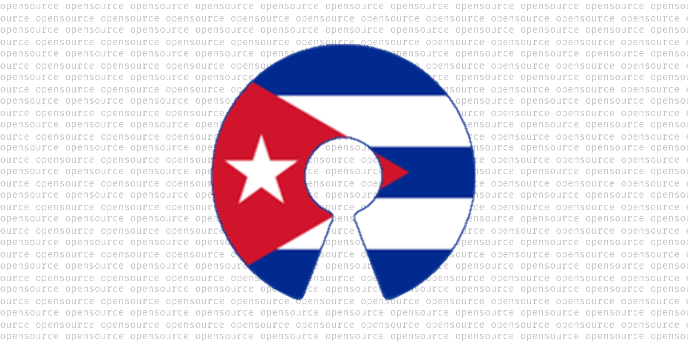
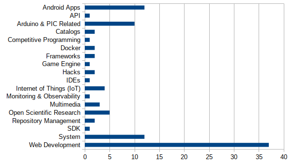

# Cuban Opensource como plataforma para la divulgación del software de código abierto echo en Cuba

Temática
--------
El desarrollo de aplicaciones y la provisión de servicios basados en Código Abierto.

Resumen
-------
Cuban Opensource es una lista  de proyectos de código abierto recolectada mediante los aportes de la comunidad que se ha ido creado mediante el boca boca y el trabajo de comunicación via correo electrónico con direcciones obtenidas mediante el scrapping de diversos sitios repositorios de software de código abierto. El objetivo es poder conocer quién está desarrollando qué en Cuba así como de unir a la agrupar a los desarrolladores cubanos en un espacio común. La lista está alojada en https://github.com/cuban-opensourcers/cuban-opensource. 

**Palabras claves:** lista, cuba, códido abierto, desarrolladores, Github

Abstract
--------
Cuban Opensource is a Github repository listing Cuban opensource projects. The list is created by Cuban developers contributions, and promoted by word of mouth and email marketing campaing with data collected with web scrapping techniques. The objective is to know who is developing what, and to create a place where Cuban developers can share a common space. The list is hosted at https://github.com/cuban-opensourcers/cuban-opensource.

**Keywords:** list, Cuba, opensource, developers, Github

Introducción
------------
Es innegable de que en Cuba se desarrolla software y parte de este es de código abierto y/o libre. Incluso, es posible encontrar cubanos trabajando en proyectos muy populares a nivel internacional. Sin embargo, es muy difícil encontrar un catálogo con esta información:

- ¿Qué se ha desarrollado?
- ¿Quién está trabajando en...?

En el 2013 ya se había tenido una experiencia similar con el anuncio de REPOGUTL, “_una alternativa «tropical» (el mayor crimen es cruzarse de brazos y no hacer nada) al tan ansiado «sourceforge cubano», aquí los desarrolladores tendrán la oportunidad de dar a conocer sus creaciones, retroalimentarse y, lo definitorio: contribuir con soluciones a los problemas que la migración y el uso del swl impone a los usuarios cubanos_” [1]. En julio del 2014, REPOGUTL contaba con más de 70 productos compartidos [2] y más información sobre este proyecto se puede consultar en el portal GUTL [3] con más de 24 publicaciones relacionadas. En determinado momento, REPOGUTL dejó de ser alojado en el servidor provincial de Joven Club de Granma y finalmente, en octubre de 2019 se decidió eliminar las copias que quedaban alojadas, debido a que el contenido consitía en paquetes binarios sin la presencia del código fuente.

Guiados por el interés de saber quién está desarrollando qué en Cuba, se comenzó a trabajar en la compilación de la lista de software cubano de código abierto.  

Tomando como referencia las _awesome lists_, y constituyendo estas un recurso de fácil acceso y modificación, populares, e incluso divertidas; se decidió crear la lista utilizando el mismo formato: un fichero texto Markdown. Esta elección además ofrece otras ventajas:

- no son necesarios recursos adicionales para su mantenimiento ya que está alojada en un servidor de terceros.
- los proyectos están también alojados en otros servidores evitando toda carga para el proyecto. 

La lista comenzó como un proyecto personal a partir de unos comentarios en Twitter [4] al respecto, partiendo de proyectos propios (de los autores) y otros que conocían habían sido desarrollado por colegas cubanos. Cuando la lista había alcanzado aproximadamente los 10 proyectos, se presentó el proyecto [5] en dos grupos de usuarios de tecnologías libres en Telegram https://t.me/blogswlx y https://t.me/GUTLOficial cuyos usuarios en su gran mayoría son cubanos. 

El proyecto tuvo buena acogida, por lo que se dedidió transformarlo en un proyecto comunitario [6] en GitHub bajo la organización Cuban Opensourcers (https://github.com/cuban-opensourcers) con lo cual se creaba un espacio más colectivo para poder mantener la lista. Para integrarse a la organización el requisito (salvo algunas excepciones) es haber compartido algún proyecto.

Para darle una representación gráfica al proyecto se creó el logotipo mostrado en la Figura 1 consistente en el símbolo del código abierto decorado con la bandera cubana, sobre una trama de texto formado por la repetición de la palabra “opensource”.



La lista se redacta en idioma inglés por ser el idioma más común en los ambientes de desarrollo de software y en busca de darle mayor visiblidad a los proyectos y desarrolladores involucrados. 

Se hizo necesario entonces dar a conocer la existencia de este recurso entre los potenciales interesados: desarrolladores de software cubanos. Una de las soluciones que surgió en el grupo fue la de recolectar direcciones de correo electrónico públicas de desarrolladores, para lo cual se acudió al propio GitHub con este fin.

No todos lo hacen, pero algunos desarrolladores completan el campo ubicación de su perfil [7], y los que tenían el valor Cuba en el mismo, fueron encontrados por medio del script que se muestra a continuación. Como resultado se recolectaron más de 300 direcciones de correo electrónico. 

```python
#!/usr/bin/python3

from github import Github

g = Github('usuario', 'contraseña')

# prints emails from Cuba
for u in g.search_users('', location='cuba'):
    if u.email:
        print (u.email)
```

Con estas direcciones de correo se elaboró otro script utlizando la biblioteca [mailproc](https://github.com/daxslab/mailproc) para enviar masivamente el siguiente correo:

> Hola!
> 
> https://github.com/cuban-opensourcers/cuban-opensource
> 
> Utilizamos su dirección de correo pública en Github para contactarle e invitarle a un proyecto reciente y de rápido crecimiento: una lista de proyectos de código abierto hechos en Cuba o por cubanos.
>
> Si usted tiene o conoce de algún proyecto que califique en la descripción anterior, háganos saber de las siguientes maneras:
>
> - respondiendo a este correo.
> - issue en el repositorio listado anteriormente
> - pull request en el mismo
>
> Visite el enlace y verá que hay listados proyectos muy variados, desde apps hasta librerías para desarrollo.
> 
> Mas información y comentarios sobre esta iniciativa en https://gutl.jovenclub.cu/aplicaciones-open-source-cuba
> 
> Agradecemos su colaboración.

Muchos de estos mensajes de correo rebotaron debido a que correspondían a ex alumnos de algunas universidades (UCI, UCLV, UO, UCF, UPR) o a ex trabajadores de entidades cubanas. Sin embargo, comenzaron a llegar las respuestas de personas que:

- tenían proyectos propios para compartir
- conocían de personas que podían tenerlos y pasaron la referencia
- compartieron la lista a través de sus medios.

Luego de 5 meses de trabajo, la lista ha crecido y en noviembre del 2019 se tienen los siguientes resultados [8]:

- Proyectos listados: 99
- Categorías principales: 18
- Subcategorías: 13
- Colaboradores: 37 (algunas cuentas son de organizaciones que agrupan a varias personas)



Materiales y métodos
--------------------
Github es la plataforma seleccionada para mantener el proyecto debido a ser una de las más populares en la actualidad y el repositorio defecto para algunos gestores de bibliotecas (Packagist para PHP, por ejemplo). La Github API es el mecanismo utilizado para obtener información sobre los proyectos y los desarrolladores de los mismos para luego poder generar información estadística. [9]

Web scrapping es el procedimiento mediante el cual es posible obtener información desde distintos lugares en Internet utilizando herramientas que hacen colectan los datos con los cuales se generara la información. En estos proyectos de catalogación es necesario desarrollar scrappers para encontrar información dispersa de forma rápida y automatizada, ahorrando tiempo y trabajo humano. [10]

Las awesome lists son listas que los usuarios crean con nombre, enlaces y descripciones de recursos alojandos en internet y que tienen elementos en común, por ejemplo, tratar del mismo tema. Es muy común entonces encontrar el “X’s Awesome List“ como una documento donde se listarán un conjunto de enlaces categorizados de recusos relacionados con X: libros, videos, extensiones, etc. [11]

Markdown es un lenguaje de marcado ligero que trata de conseguir la máxima legibilidad y facilidad de publicación tanto en su forma de entrada como de salida, inspirándose en muchas convenciones existentes para marcar mensajes de correo electrónico usando texto plano. De esta forma es posible crear un documento legible por humanos y que la vez puede ser procesado para generar un documento HTML. [12]

Conclusiones
------------

- Se cuenta con un espacio donde listar los proyectos de código abierto desarrollados en Cuba siendo este un proyecto en constante actualización.
- Los proyectos están obteniendo mayor visibilidad.
- Se están creados vínculos entre desarrolladores cubanos que antes no se conocían.
- No se cuenta aún con proyectos de ninguna institución  estatal en la lista, sólo de iniciativas personales o surgidas de la actividad comercial de sus autores.
- Salvo contadas excepciones, las instituciones cubanas invitadas a difundir/compartir este proyecto no lo han hecho a pesar de que se les ha enviado el enlace y la explicación de en qué consiste el proyecto. 

Reconocimientos
---------------

Es necesario reconocer el trabajo de las personas u organizaciones propietarias de las siguientes cuentas en Github que:

 - han contribuido con proyectos a la lista
 - han contribuido con el mantenimiento de la misma.
 
aleguerra, alejandrojnm, andaniel05, apenab, ateijelo, atscub, cjamcu, codeadict, codeshard daxslab, edelvalle, etorres, fperdigon, garciaguimeras, greenled, ivangalban, jadolg, JimScope, jmbatistav, JoseVL92, ktowen, leolopez89, llamaret, lorinkoz, n3omaster, n44ru, Nenirey, nx-desktop, oneohthree, pavelmc, PhaserEditor2D, rafageist, rlazom, rogertm, sasousuke, videomorph-dev, williamamed, yceruto.

A [@grroic](https://t.me/grroic) y [@cccaballero](https://t.me/cccaballero) que ayudaron en [SWL-X](https://blogswlx) con el scrapping. [@oneohthree](https://t.me/oneohthree) ayudó con la edición del artículo.

Referencias
-----------

- [1]	“REPOGUTL: compartiendo aplicaciones. | GUTL.” [Online]. Available: https://gutl.jovenclub.cu/repogutl-compartiendo-aplicaciones/. [Accessed: 11-Nov-2019].
- [2]	“[Gutl-l] REPOGUTL. Un repositorio de aplicaciones y productos cubanos.” [Online]. Available: https://www.mail-archive.com/gutl-l@listas.jovenclub.cu/msg32976.html. [Accessed: 11-Nov-2019].
- [3]	“REPOGUTL | GUTL.” [Online]. Available: https://gutl.jovenclub.cu/etiqueta/repogutl/. [Accessed: 11-Nov-2019].
- [4]	“Carlos C. Caballero on Twitter: ‘@AnielH1 @glpzzz @elavdeveloper @universidad_uci Si se publicara un listado de proyectos (como hacen otras distribuciones) entonces esos a los que reclamas podrían hacer algo, la mayoría de los que han escrito en este hilo contribuyen activamente a proyectos FLOSS, si no lo hacen con Nova es porque algo estarán haciendo mal’ / Twitter,” Twitter. [Online]. Available: https://twitter.com/ccesarcaball/status/1139862052904656897. [Accessed: 11-Nov-2019].
- [5]	G. López, “@glpzzz on https://t.me/blogswlx,” 15-Jun-2019.
- [6]	G. Lopez, “@glpzzz on https://t.me/blogswlx,” 17-Jun-2019.
- [7]	“Gabriel A. López on Twitter: ‘Dice @github que hay 804 desarrolladores cubanos allí. Veamos si podemos unirlos a https://t.co/hQc8GBmSpN https://t.co/4AMUbNFvkc’ / Twitter,” Twitter. [Online]. Available: https://twitter.com/glpzzz/status/1141547004998356994. [Accessed: 11-Nov-2019].
- [8]	cuban-opensourcers/cuban-opensource. Cuban Opensourcers, 2019.
- [9]	“GitHub API v3,” GitHub Developer. [Online]. Available: https://developer.github.com/v3/. [Accessed: 11-Nov-2019].
- [10]	G. Boeing and P. Waddell, “New Insights into Rental Housing Markets across the United States: Web Scraping and Analyzing Craigslist Rental Listings,” Journal of Planning Education and Research, vol. 37, no. 4, pp. 457–476, Dec. 2017.
- [11]	S. Sorhus, sindresorhus/awesome. 2019.
- [12]	J. Voegler, J. Bornschein, and G. Weber, “Markdown – A Simple Syntax for Transcription of Accessible Study Materials,” in Computers Helping People with Special Needs, Cham, 2014, pp. 545–548.
